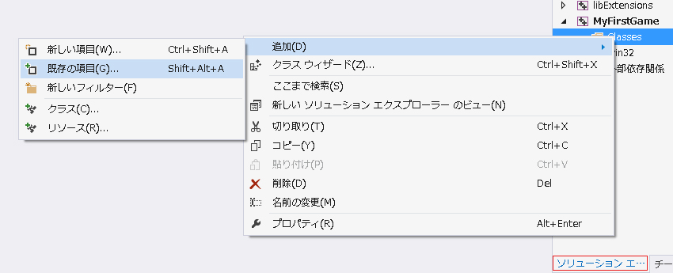

Cocos2dxBook
============
####_サンプルゲームの起動_ 
#####*本書の「Cocos2d-x開発環境の構築」の章をご覧頂いている前提で解説しています。 
1.右上の「Download ZIP」からダウンロードし、解凍します。 
2.新規にプロジェクト（名前は何でも大丈夫です。）を作成し、リビルドとビルドを行い、 
アプリケーションを実行、Helloworldを確認したらアプリケーションを閉じVisual Studioを終了します。 
3.解凍した「Cocos2dxBook-master」フォルダ内の「Classes」と「Resources」フォルダを2.のプロジェクト内に 
コピー&ペーストします。（全て上書きしてください。） 
4.Visual Studioを起動し、2.のプロジェクト内の「ゲーム名.sln」を起動します。 
5.「ソリューションエクスプローラー」内の「2.のプロジェクト名」→「Classes」を右クリックして表示される 
「追加」→「既存の項目」をクリックします。 

 
6. 2.のプロジェクトの「Classes」フォルダ内のファイルを全て選択し、右下の「追加（A）」をクリックし、追加します。 
7.「ソリューションエクスプローラー」内の「win32」→main.cppを開き、 
「eglView->setFrameSize(480, 320)」を「eglView->setFrameSize(320, 480)」にします。 
8.リビルドとビルドを行いアプリケーションを立ち上げます。 
以上でプレイが出来ます。 

タイトル：willYard 
ジャンル：引っ張りアクションゲーム 

開発環境： 
windows7 64bit SP1 
Visual Studio Community 2013 Update 4 
Cocos2d-x v2.2.6 
*他の開発環境での動作確認はしておりません。

概要： 
敵を全滅させる目的のゲーム。 
タイトル画面をタッチすると、プレイ画面に移動。 
自ターンと敵ターンが存在し、自ターンに中央に表示される「touch！」イメージをタッチ。 
引っ張って、放し、自機をショット。敵NPCに当ててダメージを与える。 
その際、ガイド矢印が表示され、ショットする方向を視認出来る 
放してから一定時間経過すると、敵ターンになり、ランダムで敵が攻撃。 
こちらのHPが0になるか、敵を全滅させるとステージクリア。
リトライボタンとバックボタンが表示され、 
リトライはもう一度プレイ、バックはタイトル画面へそれぞれ移動する。 

<a href="http://piposozai.blog76.fc2.com/" title="画像素材/ぴぽや" target="_blank">画像素材/ぴぽや</a>  
<a href="http://maoudamashii.jokersounds.com/" title="音楽素材/魔王魂" target="_blank">音楽素材/魔王魂</a>
